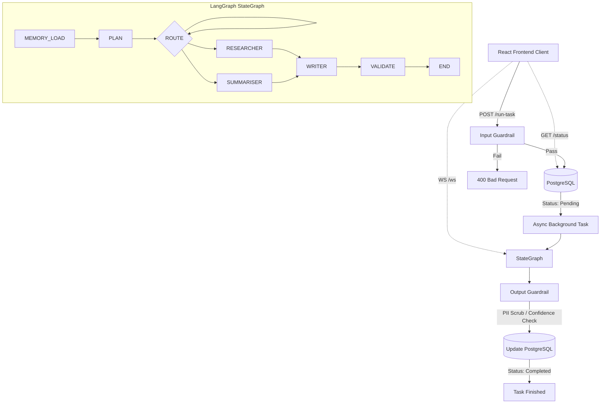

# Multi-Agent AI Workflow Automator: Project Documentation

This document provides a comprehensive overview of the Multi-Agent AI Workflow Automator project, detailing its architecture, workflows, use cases, tech stack, and the specific technologies utilized.

## 1. Architecture

The system is designed as a production-grade multi-agent architecture built on a modern 3-tier model: **Frontend Client**, **FastAPI Backend (Agent Orchestrator)**, and a **PostgreSQL Database**. It features robust guardrails, memory persistence, and asynchronous processing.

### High-Level Architecture Diagram

### Key Architectural Components
* **Agent Framework (LangGraph):** The core intelligence runs on an explicit state graph where every node, edge, and routing decision is observable. It handles the complex logic of breaking down tasks and passing them to specialist sub-agents.
* **Dual Guardrails:** 
  * **Input Guard:** Inspects inputs to prevent injection attacks before reaching the agent.
  * **Output Guard:** Validates the final output by performing PII scrubbing and checking against confidence thresholds.
* **Asynchronous Processing Layer:** Heavy agent workloads (taking 30-90s) are executed in the background to prevent HTTP timeouts. The API immediately returns a 202 status with a `task_id` for client polling or WebSocket connection.
* **Persistent Vector Memory:** Uses FAISS and FastEmbed to store task summaries and embeddings locally, allowing the system to recall past tasks and inject relevant context into new planning phases.

## 2. Workflow

The operational workflow follows a strict pipeline from user input to structured output:

1. **Task Submission:** A user submits a natural language task via the React frontend to the `/run-task` endpoint.
2. **Initial Validation (Input Guard):** The input is screened for safety and prompt injection. If blocked, a 400 error is returned immediately.
3. **Database Logging:** The task is registered in PostgreSQL with a status of `pending`. A `task_id` (UUID) is returned to the client.
4. **Graph Execution (Background):** 
   * **MEMORY_LOAD:** Retrieves up to top-3 similar past tasks from the FAISS vector store.
   * **PLAN:** Formulates a step-by-step strategy to resolve the request based on the retrieved context.
   * **ROUTE:** Dynamically decides whether to invoke the **RESEARCHER**, **SUMMARISER**, or other specialist nodes based on the current state and plan.
   * **WRITER:** Compiles findings from the active nodes into a coherent response.
   * **VALIDATE:** Verifies that the drafted response fulfills the user's initial request.
5. **Output Guarding:** The final draft undergoes PII redaction and a confidence score check.
6. **Completion:** The output and confidence score are saved to PostgreSQL (status updated to `completed`), and the local FAISS index is updated with the new result for future memory retrieval.
7. **Client Delivery:** The React frontend displays the result either by receiving continuous updates over a WebSocket connection (`/ws/{task_id}`) or by polling the status endpoint (`/status/{task_id}`).

## 3. Use Case

The Multi-Agent AI Workflow Automator is primarily designed for **complex, multi-step analytical and research tasks** that require reasoning, web searching, data synthesis, and structured reporting.

**Example Use Cases:**
* **Market Research & Competitive Analysis:** "Research the top 3 insurtech companies in India and compare their funding rounds and business models."
* **Technology Trends Synthesis:** "What are the main AI trends in Indian healthcare in 2024? Write a one-page report."
* **Technical Comparisons:** "Summarise the key differences between LangGraph and CrewAI for building multi-agent systems."

The system shines in scenarios where a simple LLM query is insufficient, requiring instead a coordinated team of "Researcher", "Summariser", and "Writer" agents to gather current internet data, condense it, and formulate a high-confidence, safe response.

## 4. Tech Stack

| Layer | Technology |
|---|---|
| **Agent Framework** | LangGraph 0.2 |
| **LLM Inference** | Groq Llama-3.3-70B (Primary), Gemini 1.5 Flash (Fallback) |
| **Search Engine** | Tavily API |
| **Vector DB / Memory** | FAISS + FastEmbed (Local) |
| **Backend API** | FastAPI (Python) + asyncio |
| **Relational Database** | PostgreSQL + SQLAlchemy 2.0 (async) + Alembic |
| **Frontend** | React, Vite, TypeScript, TailwindCSS |
| **Observability** | LangSmith |
| **Orchestration/CI/CD**| Docker, Docker Compose, Railway, GitHub Actions |

## 5. Technologies Used (Detailed Breakdown)

* **LangGraph 0.2:** Replaces implicit agent frameworks (like CrewAI) by offering explicit state management. It makes debugging easier because developers can visually and programmatically trace every graph node (MEMORY, PLAN, RESEARCHER, etc.).
* **FastAPI & Asyncio:** Provides a lightning-fast, asynchronous Python backend. Enables the non-blocking "accept immediately, process in background" pattern vital for slow LLM tasks, and seamlessly handles WebSocket streaming.
* **PostgreSQL (with SQLAlchemy & Alembic):** A production-grade relational database handling concurrent writes from multiple FastAPI workers. Alembic is utilized to manage schema evolution.
* **Groq Llama-3.3-70B:** Chosen for highly performant and extremely fast inference capabilities.
* **Gemini 1.5 Flash:** Acts as an LLM provider abstraction, providing a resilient fallback mechanism if the primary LLM fails.
* **Tavily API:** A web search engine purpose-built for LLMs, ensuring the agents receive clean, parsed text rather than raw, noisy HTML.
* **FAISS & FastEmbed:** Enables on-disk, localized vector storage and embedding without relying on expensive external APIs. This powers the system's long-term memory capabilities.
* **React + Vite + TypeScript:** A modern, type-safe frontend toolchain ensuring rapid development and optimized production builds. Allows for complex state management required for polling and live WebSocket streaming.
* **Docker & Docker Compose:** Standardizes local development and deployment by containerizing the PostgreSQL database, FastAPI backend, and React frontend into easily orchestrated microservices.
* **LangSmith:** Tightly integrated with LangGraph to trace every LLM call, monitor token usage, and track latency for deep observability.
